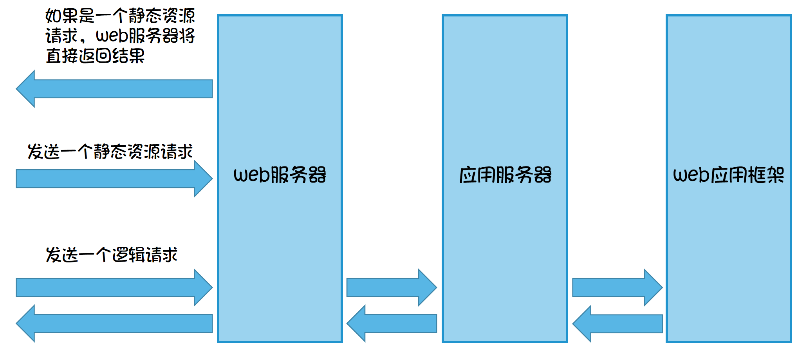

# Flask 介绍

无论用什么标准来评判，Flask都算是一个小型框架，甚至是“微框架”。  
但是这并不意味着它的功能不够强大。Flask是一款可以扩展的框架，它具有一个包含基本功能的强健核心。其他的功能则可通过拓展实现，你可以自定义一个适合你的Flask。

Flask有3个主要依赖：路由，调试和Web服务器网关接口(**WSGI**, Web server gateway interface)子系统由**Werkzeug**提供; 模板系统则是由**Jinja2**提供; 命令行集成由**Click**提供。这些依赖全部都是Flask的开发者 **Armin Ronacher** 开发的（鼓掌）。


<br/>


# Flask 安装

首先，你要有台已经安装了**Python**的计算机。你也可以使用**虚拟环境**，这里不过多介绍。不论如何，只要在控制台中键入：

> pip install flask

就可以坐享其成了。

如果没有错误提示，**那么我们就可以继续了~**


<br/>

# 预备知识

正式开始使用Flask之前，要先了解一些知识。

## 简要讲解一下URL：

**URL**是Uniform Resource Locator的简写，即**统一资源定位符**。

一个URL由以下几部分组成：

```url
scheme://host:port/path/?query-string=xxx#anchor
```

* scheme：代表的是访问的协议，一般为http或者https以及ftp等。

* host：主机名+域名，比如 `www.baidu.com` 。
  
* port：端口号。当你访问一个网站的时候，浏览器默认使用80端口。
  
* path：查找路径。比如：`eoralmilk.github.io/img/flask/` ，后面的 `img/flask` 就是path。
  
* query-string：查询字符串，比如：`www.baidu.com/s?wd=python` ，后面的 `wd=python` 就是查询字符串。
  
* anchor：锚点，后台一般不用管，前端用来做页面定位的。比如：`https://baike.baidu.com/item/%E5%88%98%E5%BE%B7%E5%8D%8E/114923?fr=aladdin#7` 最后面的 `#7` 就是锚点。

## web服务器和应用服务器以及web应用框架：

### web服务器：

负责处理http请求，响应静态文件，常见的有Apache，Nginx以及微软的IIS.

### 应用服务器：

负责处理逻辑的服务器。比如php、python的代码，是不能直接通过nginx这种web服务器来处理的，只能通过应用服务器来处理，常见的应用服务器有uwsgi、tomcat等。

### web应用框架：

一般使用某种语言，封装了常用的web功能的框架就是web应用框架，flask、Django以及Java中的SSH(Structs2+Spring3+Hibernate3)框架都是web应用框架。




**那么下一章就开始正式学习Flask！**

## [开始学习，冲冲冲！(暂时冲不了)]()


---  

Author: EoralMilk  
Link: [Post/2020/02/26/# FlaskA1]()   
**本文采用[知识共享署名-非商业性使用 4.0 国际许可协议](https://creativecommons.org/licenses/by-nc-sa/4.0/)进行许可**  

---